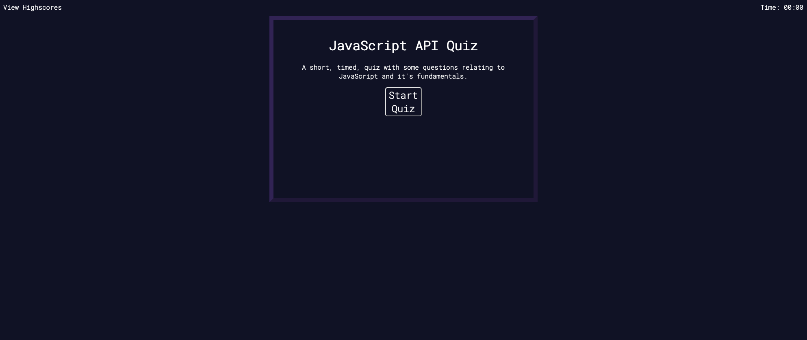

# JavaScriptQuiz
Creating a simple JavaScript API quiz using vanilla JavaScript

## Overview
Admittedly I think the approach taken was very React-esque, but only the portion where buttons are made.

## About the quiz buttons
That part was actually super frustrating, because apparently the .remove() function will exit any kind of loop, meaning the only way I could find to remove buttons was to do it recursively. It's not super necessary since I'm in control of the questions, however I wanted it to be built in such a way that hypothetically it could handle anywhere from 1 -> infinite possible answers so hard coding 4 buttons onto the page was not an option. They get their own section in the README because I am still salty, but still somewhat happy with getting it to work the way I wanted.

## Link
The project can be found here [on my github.io](https://reidmadock.github.io/JavaScriptQuiz/)

## Screenshots
This is what the site looks like when you initially load it.
